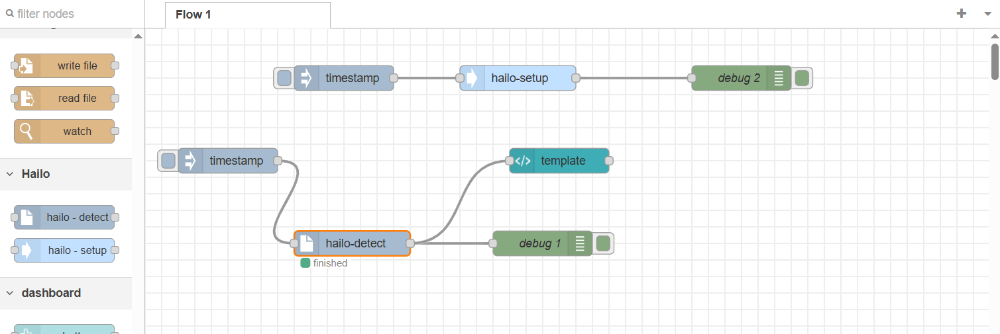
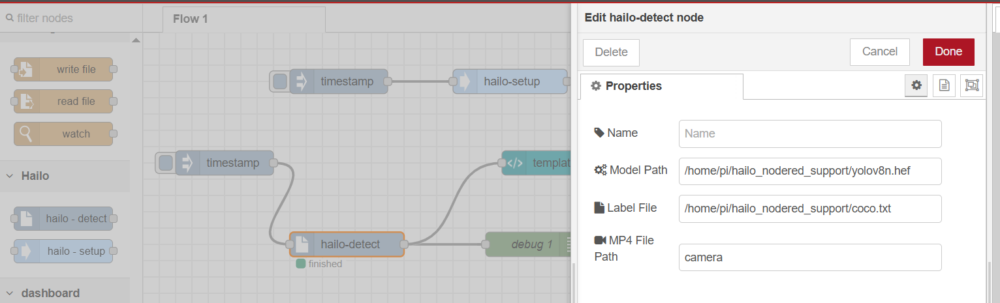

# 🚀 node-red-contrib-hailo-detect

Custom Node-RED nodes to interface with Hailo AI for object detection and pose estimation using Raspberry Pi and Hailo-8 accelerator.

---

## 🧰 Prerequisites

Before using this Node-RED node, please prepare your Raspberry Pi environment by following the official Seeed tutorial:

🔗 [Prepare Raspberry Pi for Hailo](https://seeed-projects.github.io/Tutorial-of-AI-Kit-with-Raspberry-Pi-From-Zero-to-Hero/docs/Chapter_2-Configuring_the_RaspberryPi_Environment/Introduction_to_Hailo_in_Raspberry_Pi_Environment#installing-hailo-software-on-raspberry-pi-5)

This includes:

- Setting up the Pi OS
- Installing Hailo drivers and SDK
- Verifying device connection (`hailortcli`)

---

## 📦 Installation

### 1️⃣ Clone the Repository

```bash
git clone https://github.com/KasunThushara/node-red-contrib-hailo-detect.git
```

---

### 2️⃣ Navigate to Node-RED User Directory

```bash
cd ~/.node-red
```

---

### 3️⃣ Install the Custom Node

Replace the path below with the actual path to your cloned repo:

```bash
npm install /full/path/to/node-red-contrib-hailo-detect
```

---

### 4️⃣ Restart Node-RED

If installed globally:

```bash
node-red-stop
node-red-start
```

Or with systemctl:

```bash
sudo systemctl restart nodered.service
```

---

## 🧪 How to Use



### 1️⃣ Install Dependencies

Use the `hailo-setup` node. This will install the necessary Python packages, Flask server, and set up the environment.

> 🔁 Run this once before using the detection or pose nodes.

---

### 2️⃣ Detect Objects


Use the `hailo-detect` node.

- `Model (.hef) path`: Path to the Hailo model
- `Label file`: Path to the `.txt` label file
- `Input source`: 
  - Use `"camera"` for webcam/live stream
  - Or provide path to an `.mp4` file

This node runs the detection and launches a Flask video stream.

---

### 3️⃣ Estimate Pose

Use the `hailo-pose` node.

- `Model (.hef) path`: Path to the Hailo model
- `Input source`: 
  - Use `"camera"` for webcam 
  - Or provide a path to an `.mp4` file


---

### 4️⃣ View Live Stream in Dashboard

Use a **`ui-template`** node and paste the following code (replace `your-pi-ip` with your Raspberry Pi’s IP):

```html
<div style="text-align: center;">
    
    
    <br><br>
    <button onclick="fetch('http://your-pi-ip:5001/stop')" style="padding: 10px 20px; font-size: 16px; background-color: #ff4444; color: white; border: none; border-radius: 5px; cursor: pointer;">
        Stop
    </button>
</div>
```

✅ This will show the live video stream and allow users to stop the inference session.

---

## 📁 Node List

- **`hailo-setup`** — Install required dependencies and set up the environment.
- **`hailo-detect`** — Run object detection using Hailo model and input.
- **`hailo-pose`** — Perform real-time pose estimation from webcam or video file.

---

